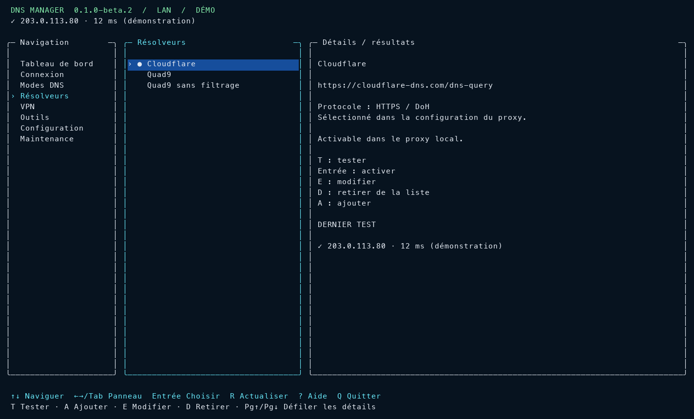

# DNS Manager pour macOS


**Comprendre et piloter le DNS du Mac depuis une app terminal, avec un voyant dans la barre de menus.**

[English](README.en.md) · [Architecture](docs/ARCHITECTURE.md) · [Autorisation système](docs/ADMIN.md) · [Historique](CHANGELOG.md)

DNS Manager rassemble les connexions réseau, les résolveurs et les tests DNS dans une interface à trois colonnes. Choisir LAN ou Wi-Fi, tester une cible, puis basculer entre les DNS du réseau et un proxy local chiffré. Les VPN sont présentés séparément pour comprendre leurs propres DNS.



*Aperçu issu du mode démo : données fictives, aucun réseau personnel affiché.*

## Fonctions

| Fonction | Utilisation |
|---|---|
| TUI plein écran | Flèches, panneaux, formulaires, résultats et couleurs |
| Deux modes | Automatique ou DNS local sur `127.0.0.1` et `::1` |
| Résolveurs | Ajouter, modifier, tester et sélectionner une cible |
| DNS chiffré | DoH et DNSCrypt via dnscrypt-proxy ; stamp automatique pour HTTPS |
| Diagnostic | Résolution native macOS, doggo et temps de réponse |
| Réseau et VPN | LAN / Wi-Fi, profils exposés par macOS et DNS du tunnel |
| Barre de menus | Voyant vert / orange / rouge et ouverture du TUI |
| Maintenance | Cache, service, installation et mise à jour des outils |
| Restauration | Sauvegarde avant changement et retour arrière |

Les résolveurs prédéfinis sont publics : Cloudflare, Quad9 et Quad9 sans filtrage. Les DNS locaux et les fournisseurs personnalisés se configurent dans l'app ; aucun réseau privé n'est imposé par défaut. Pour un nom HTTPS privé, le champ facultatif **IP du serveur HTTPS** évite une dépendance au DNS du proxy lui-même ; le certificat reste vérifié avec le nom HTTPS.

## Dépendances

| Dépendance | Rôle |
|---|---|
| macOS 13+ | Plateforme cible |
| Swift 5.9+ et Apple Command Line Tools | Compilation ; testé avec Swift 6.4 sur Apple Silicon |
| ncurses, Foundation, AppKit | Fournis par macOS |
| [doggo](https://github.com/mr-karan/doggo) | Tests DNS et résultats JSON |
| [dnscrypt-proxy](https://github.com/DNSCrypt/dnscrypt-proxy) | Proxy DNS local chiffré |
| [Homebrew](https://brew.sh) | Installation et maintenance des outils |
| [Ghostty](https://ghostty.org) | Facultatif ; Terminal fonctionne aussi |

Python n'est **pas** nécessaire pour lancer l'app. Il sert uniquement aux tests de l'interface, avec `pyte` et éventuellement Pillow.

## Démarrer

Depuis la racine du dépôt :

```bash
xcode-select --install            # si les outils Apple sont absents
brew install doggo dnscrypt-proxy
bash scripts/build.sh
./dist/dns-manager --tui
```

La compilation produit dans `dist/` :

- **Lancer TUI.command** — ouvrir dans Terminal.
- **Lancer TUI Ghostty.command** — ouvrir dans Ghostty.
- **DNS Manager.app** — voyant de barre de menus, sans fenêtre ni icône dans le Dock.
- **Installer autorisation DNS.command** — autorisation système durable facultative.

Au premier lancement, choisir **Connexion → LAN ou Wi-Fi**, puis ouvrir **Résolveurs** et tester une cible. Sélectionner une connexion ne change pas les DNS ; une activation demande confirmation.

```bash
./dist/dns-manager --demo          # aperçu fictif en lecture seule
./dist/dns-manager --version
./dist/dns-manager --status
./dist/dns-manager --check 127.0.0.1 example.com
./dist/dns-manager --check https://cloudflare-dns.com/dns-query example.com
./dist/dns-manager --audit-cache
```

## Navigation

| Touches | Action |
|---|---|
| `↑` / `↓` | Naviguer dans le panneau actif |
| `←` / `→`, `Tab`, `Maj-Tab` | Changer de panneau |
| `Entrée` | Sélectionner ou ouvrir une action |
| `T` | Tester le résolveur ou les DNS du VPN |
| `A` / `E` / `D` | Ajouter / modifier / retirer un résolveur |
| `R` | Actualiser les contrôles |
| `Page haut` / `Page bas` | Défiler les détails |
| `Esc` | Annuler ou revenir à la navigation |
| `?` / `Q` | Aide / quitter |

Minimum **64 × 18** caractères. À partir de **110 colonnes**, les trois panneaux sont visibles ; en dessous, l'interface en affiche deux. Les contrôles travaillent en arrière-plan et s'actualisent chaque minute. `--simple` conserve les menus numérotés.

## Données et droits système

Les réglages restent dans `~/Library/Application Support/DNSManager/`, hors Git. `settings.json` et `restore.json` utilisent les permissions `0600`. Aucun mot de passe n'est enregistré.

Sans autorisation durable, les opérations système utilisent la fenêtre administrateur macOS. L'activation d'un résolveur et sa restauration regroupent les étapes dans une transaction.

L'autorisation durable est **facultative et expérimentale dans cette bêta**. Le composant root accepte des actions DNS définies, sans commande libre. L'installation protège la configuration et une copie du proxy et redémarre le service existant. [Installation, mise à jour et retrait](docs/ADMIN.md).

## État de la bêta

Compilation, TUI, voyant, contrôles DNS et navigation vérifiés sur un Mac Apple Silicon. Vérifications du moteur et tests de terminal inclus.

- Installation, état, cache et activation du composant administrateur vérifiés sans nouvelle demande de mot de passe. Restauration et retrait restent à valider sur une machine de test.
- La détection VPN dépend des informations exposées par macOS. Profils, clés et routes ne sont pas modifiés.
- DoT, DoQ et DNS direct sont des cibles de **test** ; l'activation utilise DoH ou DNSCrypt.
- Le voyant indique la résolution, pas le chiffrement de toutes les applications.
- Pas de binaire universel ni de notarisation pour cette première bêta.
- Interface en français ; documentation française et anglaise.

## Vérifier et contribuer

```bash
bash scripts/check.sh
python3 -m venv .venv
.venv/bin/python -m pip install -r requirements-dev.txt
.venv/bin/python scripts/test_terminal.py
.venv/bin/python scripts/test_terminal.py --preview
```

Les tests utilisent des réglages isolés et n'appliquent aucune bascule DNS réelle. Le dernier appel génère l'aperçu générique du README. [Contribuer](CONTRIBUTING.md) · [Audit Quad9](docs/QUAD9.md).

La licence de distribution n'est pas encore définie pour cette bêta.
